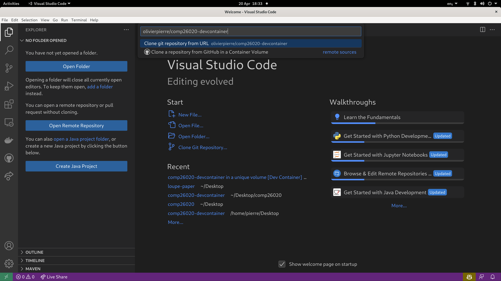
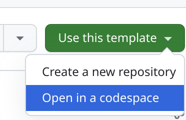

# COMP26020 C Part: Lecture Code Snippets

This repository contains running examples for all the code snippets presented
in the [lecture slides](https://olivierpierre.github.io/comp26020-lectures/) of
the C part of COMP26020.

## How to Download and Run the Examples

There are 3 ways to run the examples:
- [Using Linux natively or in a VM](#using-linux-natively-or-in-a-vm)
- [Using VSCode and Docker on Windows or Mac](#using-vscode-and-docker-on-windows-or-mac)
- [Using GitHub Codespaces in your browser with any OS](#using-github-codespaces-in-your-browser)

### Using Linux Natively or in a VM

We will use for marking the lab exercise Ubuntu 22.04, so you should use it too.
You'll need to install the following debian and python packages:
```
sudo apt-get update && sudo apt-get install -y build-essential valgrind \
    python3 vim bash-completion git gdb python3-pip

pip3 install check50
```

If you are browsing the slides online, simply click on the snippet name, which
is the blue link at the bottom right of the snippet (in the example below it is
`00-logistics/sample-code.c`).


That should launch the download of the file, you can them compile and run as
seen in the course.

### Using VSCode and Docker on Windows or Mac

1. Install [VSCode](https://code.visualstudio.com/download) and get the
  [Dev Containers](https://marketplace.visualstudio.com/items?itemName=ms-vscode-remote.remote-containers)
  extension
2. Install [Docker](https://docs.docker.com/get-docker/)
3. Make sure Docker is running, Launch VSCode and bring up the command palette
   with the following command:
  - On Windows, <kbd>ctrl</kbd> + <kbd>shift</kbd> + <kbd>p</kbd>
  - On Mac, <kbd>shift</kbd> + <kbd>command</kbd> + <kbd>p</kbd>
4. Choose the command `Dev Containers: Clone Repository in Container Volume`
   and type the repo URL on GitHub: `olivierpierre/comp26020-devcontainer`



The container image will take a bit of time to be fetched during the first
launch. It is based on Ubuntu 22.04.

**This is a volatile enviroment and all your modifications to the container's
filesystem will be lost when you exit this VSCode window, hence it is *not* a
good environment for working on lab exercises.**

### Using GitHub Codespaces in your Browser

Codespaces is normally a paid feature but you can get access to it for free with
a [student](https://education.github.com/pack/?WT.mc_id=academic-81409-leestott)
account.

Go to the repository page on GitHub, and click on `Use this template` then
`Open in a codespace`.



**This is also a volatile enviroment and it is *not* a good one for working on
lab exercises.**
