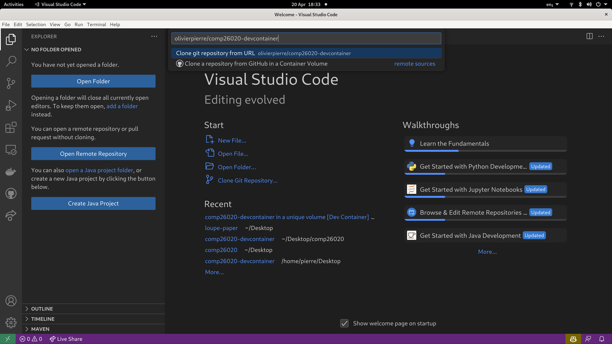
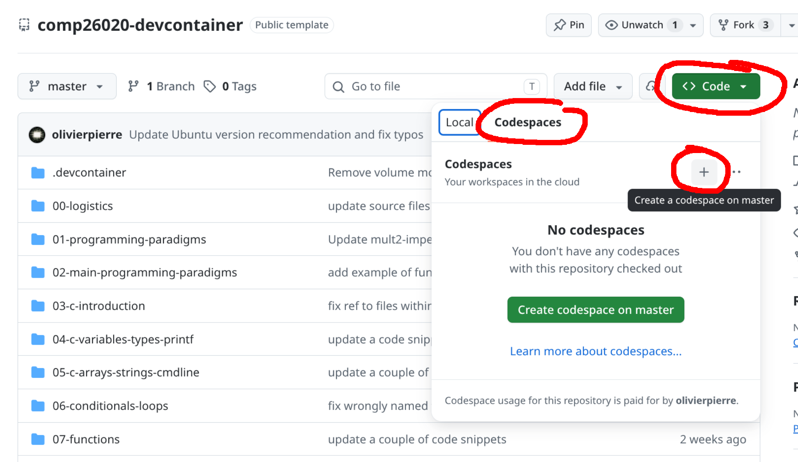
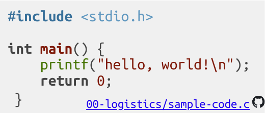

# COMP26020 C Programming: Development Environment and Lecture Code Snippets

This repository contains instructions on how to set up a proper development environment to complete the formative programming exercises for the first part of COMP2602 (C programming).
It also contains running examples for all the code samples presented in the [lecture slides/notes](https://olivierpierre.github.io/comp26020/).

## Setting Up Your Development Environment

As explained in the lecture you will need a Linux x86-64 (Intel CPU) environment to complete the formative exercises and run the code samples.
Based on your situation there are 3 ways to set it up:
- [Using Linux natively or in a VM](#using-linux-natively-or-in-a-vm), if you have access to a machine with an Intel/AMD CPU. Note that the University lab machines run Linux natively so they are suitable.
- [Using VSCode and Docker](#using-vscode-and-docker-on-windows-or-mac). That solution should work on any type of personal machine but you'll likely need administrative access.
- [Using GitHub Codespaces in your browser with any OS](#using-github-codespaces-in-your-browser). That solution is in-browser only and should work anywhere.

### Using Linux Natively or in a VM

We will use for marking the lab exercise Ubuntu 24.04, so you should use it too.
You'll need to install a few Debian packages with the following commands:

```
sudo apt-get update && sudo apt-get install -y build-essential valgrind python3 vim bash-completion git gdb python3-pip
```

> If you are on one of the University's lab machines, these packages are already installed so no need to run the command above

At that stage you can [install check50 and complete the dummy exercise](https://olivierpierre.github.io/comp26020/exercise-set-1.html#installing-check50) and you are good to go.

### Using VSCode and Docker on Windows or Mac

1. Install [VSCode](https://code.visualstudio.com/download) and get the [Dev Containers](https://marketplace.visualstudio.com/items?itemName=ms-vscode-remote.remote-containers) extension.
2. Install [Docker](https://docs.docker.com/get-docker/).
3. Make sure Docker is running, Launch VSCode and bring up the command palette with the following command:
  - On Windows, <kbd>ctrl</kbd> + <kbd>shift</kbd> + <kbd>p</kbd>.
  - On Mac, <kbd>shift</kbd> + <kbd>command</kbd> + <kbd>p</kbd>.
4. Choose the command `Dev Containers: Clone Repository in Container Volume` and type the repo URL on GitHub: `olivierpierre/comp26020-devcontainer`.



The container image will take a bit of time to be fetched during the first launch.
Files created in a container will persist until the container is deleted.
You may need to restart the container if you exit the VSCode window.

At that stage you can [install check50 and complete the dummy exercise](https://olivierpierre.github.io/comp26020/exercise-set-1.html#installing-check50) and you are good to go.

### Using GitHub Codespaces in your Browser

Codespaces is normally a paid feature but you can get access to it for free with a [student](https://education.github.com/pack/) account.

Go to [this repository's page on GitHub](https://github.com/olivierpierre/comp26020-devcontainer), and click on `<> Code`, `Codespaces`, and `+`.



Files created in the codespace will persist until the codespace is deleted (this can be done through the this interface: https://github.com/codespaces).

At that stage you can [install check50 and complete the dummy exercise](https://olivierpierre.github.io/comp26020/exercise-set-1.html#installing-check50) and you are good to go.

## Running the Lectures' Code Samples

If you are running Linux natively or in a VM, when accessing the slides online, simply click on the snippet name, which is the blue link at the bottom right of the snippet (in the example below it is
`00-logistics/sample-code.c`):



That download the file in question, you can them compile and run it as [seen in the unit](https://olivierpierre.github.io/comp26020/03-c-introduction.html#hello-world-in-c).

If you are running the container either on your local machine or in a Codespace, you can simply access the file indicated at the bottom left of each code sample (in the example above, it's `00-logistics/sample-code.c`).